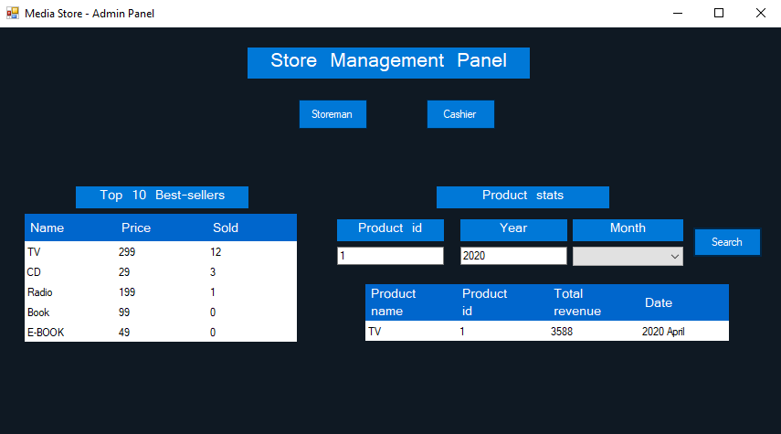
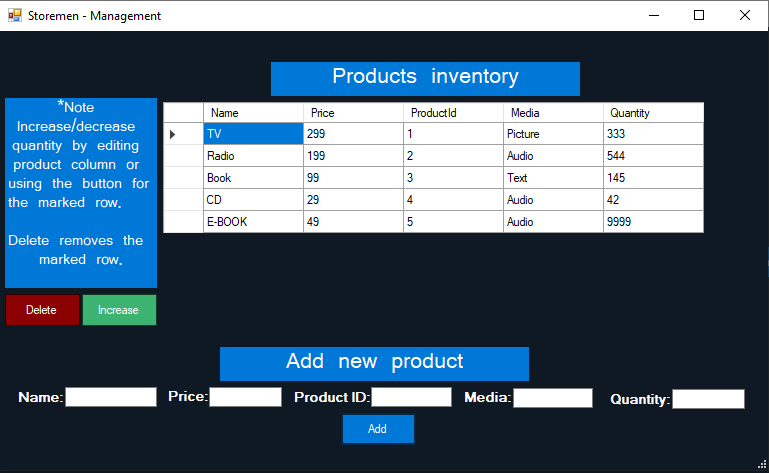
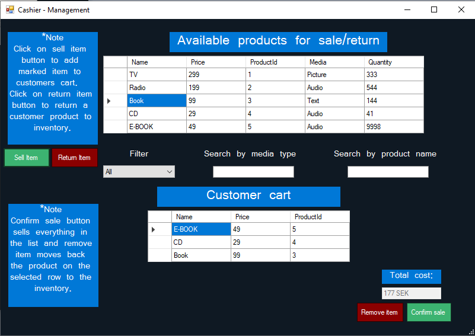

# Media store
A management application for a media store written in c#.net for a university course.
The application is divided into 3 different screens (Start/main screen, Storeman screen and Cashier screen)

Functionality for Start/Main screen:
- Navigation to Storeman/Cashier screen.
- Lists top 10 sold products for the media store.
- Search for sale statistics of a product, returns how many times a product has been sold and 
  revenue for the products over given period.

  

Functionality for Storeman screen:
- List (read) current products in store from CSV file.
- Add new products and save to CSV file.
- Order (increase quantity) more of a existing product.
- Delete sold out products.

  

Functionality for cashier screen:
- List (read) current products in store from CSV file.
- Add existing store products to customer cart.
- Search/filter to find products in store.
- Confirm sale, sell everything in customers cart (products from storage decreases).
- Once sale is confirmed products CSV file is updated and a orders.CSV file is created/updated to store all sales.

  

